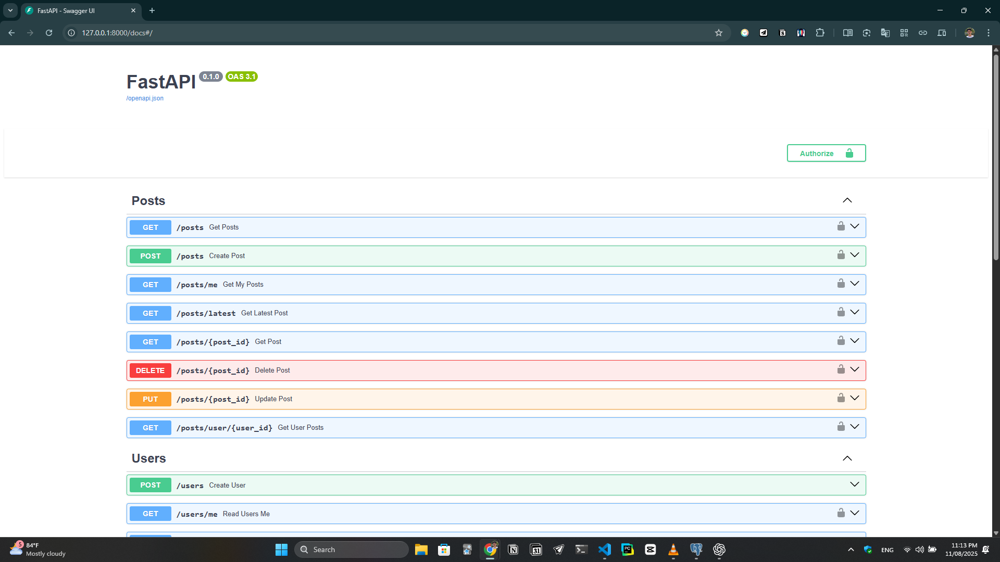
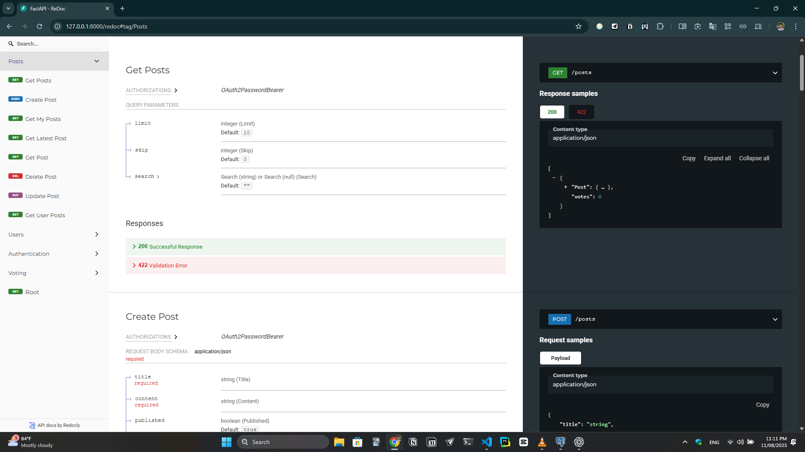
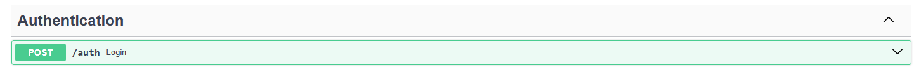
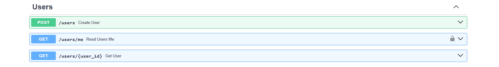
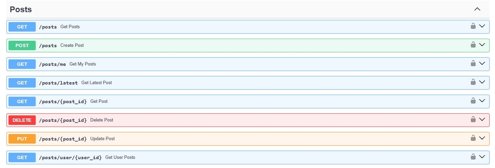
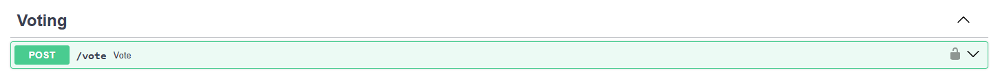

# FastAPI Social Media App

A fully-featured REST API built with **FastAPI**, **SQLAlchemy**, and **PostgreSQL** (SQLite for demo purposes).
Includes authentication, CRUD operations for posts, voting, and pagination — designed for production but easy to run locally.

---

## 🚀 Features

- **User Authentication & Authorization** (JWT, OAuth2 password flow)
- **Post Management** (create, read, update, delete)
- **User Management** (register, profile, get by ID)
- **Voting System** (upvote, downvote, remove vote)
- **Pagination & Search** for posts
- **Get posts by specific user**
- **Latest post endpoint**
- **Database Migrations** with Alembic
- **Environment-based Secrets Management**
- **SQLite for demo — PostgreSQL ready**

---

## 🛠 Tech Stack

- **Backend Framework**: FastAPI
- **Data Validation**: Pydantic v2
- **Database**: PostgreSQL (production), SQLite (demo)
- **ORM**: SQLAlchemy
- **Migrations**: Alembic
- **Testing/Debugging**: Postman
- **Project Management**: uv
- **Language**: Python 3.11+

---

## 📂 Project Structure

```bash
FASTAPI Social Media App/
├── .venv/
├── alembic/
├── app/
│   ├── core/
│   │   ├── __init__.py
│   │   ├── config.py
│   │   ├── database.py
│   │   ├── db_driver.py
│   │   ├── oauth2.py
│   ├── models/
│   │   ├── __init__.py
│   │   ├── post.py
│   │   ├── user.py
│   │   ├── vote.py
│   ├── routers/
│   │   ├── __init__.py
│   │   ├── auth.py
│   │   ├── post.py
│   │   ├── user.py
│   │   └── vote.py
│   ├── schemas/
│   │   ├── __init__.py
│   │   ├── post.py
│   │   ├── token.py
│   │   ├── user.py
│   │   └── vote.py
│   ├── utils/
│   │   ├── __init__.py
│   │   └── security.py
│   ├── __init__.py
│   └── main.py
├── .env.example
├── .gitignore
├── .python-version
├── alembic.ini
├── pyproject.toml
├── README.md
└── uv.lock

```

---

## ⚡ Installation & Running Locally

```bash
# Clone the repository
git clone https://github.com/yourusername/fastapi-blog-api.git
cd fastapi-blog-api

# Install uv (project manager)
pip install uv

# Run the development server
uv run fastapi dev
```

---

## 📜 API Documentation

Once the server is running:

* Swagger UI: [http://127.0.0.1:8000/docs](http://127.0.0.1:8000/docs)
* ReDoc: [http://127.0.0.1:8000/redoc](http://127.0.0.1:8000/redoc)

---
### **Swagger UI Preview:**


### **Redoc UI Preview:**


---

## 📌 API Endpoints

### **Auth Routes** (`/auth`)


### **User Routes** (`/users`)


### **Post Routes** (`/posts`)


### **Vote Routes** (`/vote`)


---
## 📄 License

This project is licensed under the **MIT License** — feel free to use and modify it.

---

## 💼 About the Developer

Developed by **Ahmed Aboelnaga** — AI/ML Engineer & Backend Developer.  
[GitHub](https://github.com/ahmedgaboelnaga)  |  [LinkedIn](https://www.linkedin.com/in/ahmedgaboelnaga/)  
ahmedgaboelnaga@gmail.com
